# Admin-side Guide

<i>\*If you're looking for a guide for developers, check out the [Technical Guide](tech.md).</i>

## Home Page

> Upon navigating to the <a href="https://www.profiles.jlmstrategic.com">Teambldr</a> website, you will see the following view:

> 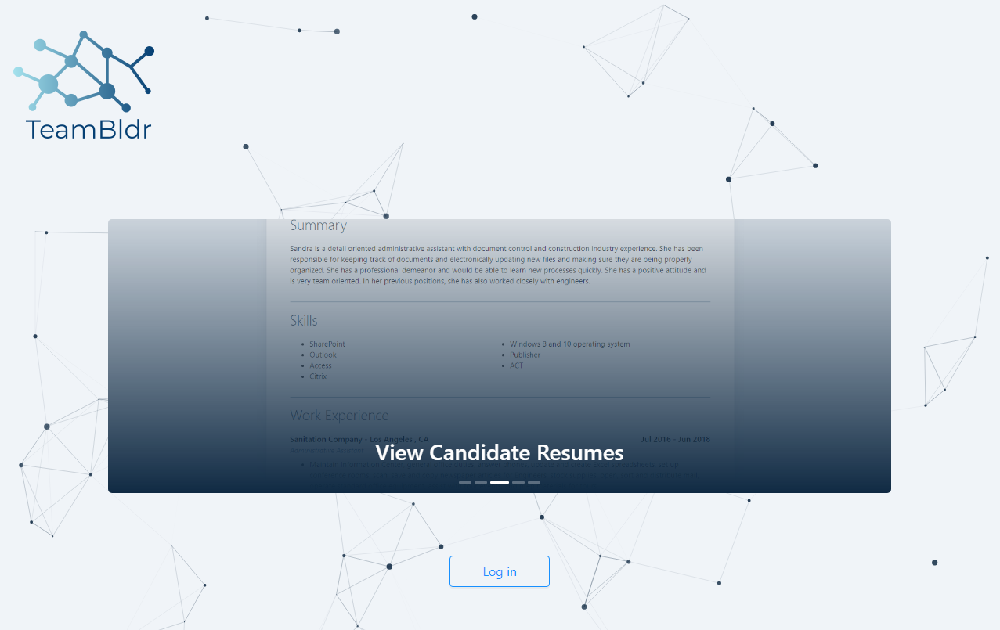

> You can look through the several core features of TeamBldr and navigate to the login page by clicking the "Log in" button.

---

## Login Page

> 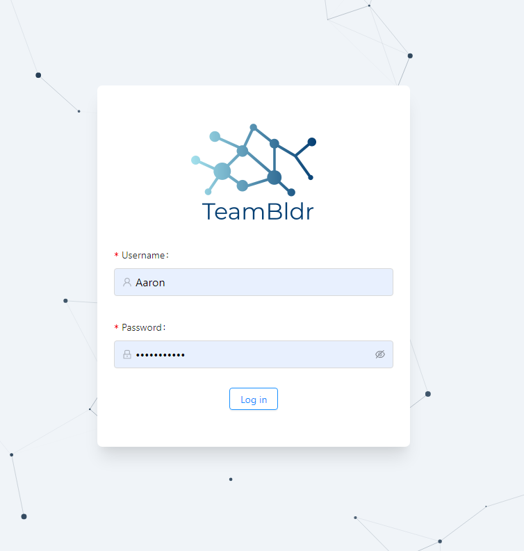

> <i>Note that the credentials are <u>case-sensitive</u><i>

---

## Admin Dashboard

> Most of the functionalities and navigations will be in the Admin Dashboard. There are several components embedded as a sub-section in this component, which will be broken down to the [Search Bar](admin-guide.md#search-bar) and the [Sidebar](admin-guide.md#sidebar) components. Below is the image overview of the admin dashboard:

> 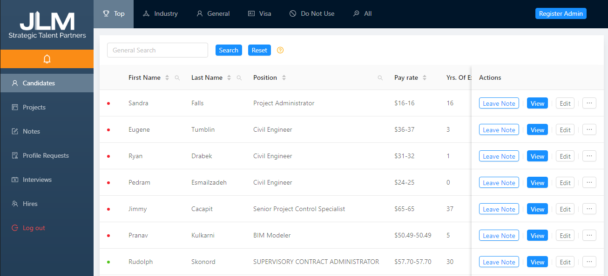

---

### Search Bar

> There is a search bar for the candidates dashboard:

> 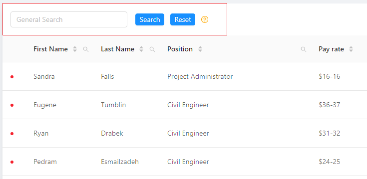

> There is a tooltip denoted by the `?` next to the search bar that further elaborates the inclusion of the search, which include:

> |                                                     |
> | :-------------------------------------------------: |
> |                         MPC                         |
> |                   Candidate Name                    |
> |                 Candidate Position                  |
> |                 Candidate Location                  |
> |     Profile Completion (Complete or Incomplete)     |
> | Candidate Status (Active, Inactive, or Unavailable) |

 
> The <strong>Reset</strong> button will reset the current search query and return all candidates for that specific section.

---

### Sidebar

> The sidebar consists of the following list of tabs:

> |    Tab     | Description                                    |
> | :--------: | :--------------------------------------------- |
> | Candidates | Table with all candidates with categorization  |
> |  Projects  | Table with all projects with categorization    |
> |   Notes    | Table with all notes for candidates            |
> | Interviews | List of all requested and scheduled interviews |
> |   Hires    | List of all pending/completed hires            |
> |  Log Out   | Button to prompt log out                       |

#### Candidates

> The `Candidates` tab contains a table that displays all the candidates in their own category. The categories are defined as follows:

> |     Category     | Description                                                            |
> | :--------------: | :--------------------------------------------------------------------- |
> |       Top        | Top-line candidates                                                    |
> |     Industry     | Candidates with experience in the construction/infrastructure industry |
> |     General      | Majority of candidates that end up in the application                  |
> |       Visa       | Candidates that are on visa or require sponsorship                     |
> | Do Not Use (DNU) | Candidates that should not be used (based on red flags)                |

> The candidate table will render the candidates in the selected category-tab.

> Additionally, you can interact with each candidates in the table; you can leave notes for a candidate, view their profile, [edit](admin-guide.md#edit-page) their information, or delete them.

> For the full list of candidate interactivity, see the [Candidates](admin-guide.md#candidates_1) section

---

#### Projects

> The `Projects` tab contains a table that displays all the projects among its categories:

> 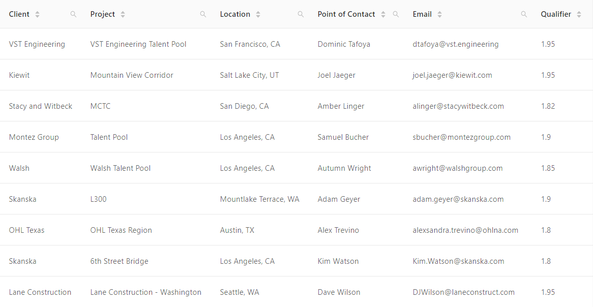

> The categories are defined as follows:

> | Category | Description                                    |
> | :------: | :--------------------------------------------- |
> |  Active  | Projects that we are actively working with     |
> | Inactive | Projects that we are not actively working with |
> |   Demo   | Projects pending demo for TeamBldr             |

 

> Detailed information about the projects can be found in the [Project](admin-guide.md#projects_1) section.

---

#### Notes

> The `Notes` tab contains a table that displays all the notes written for the candidates within the application, in the descending order of creation.

> 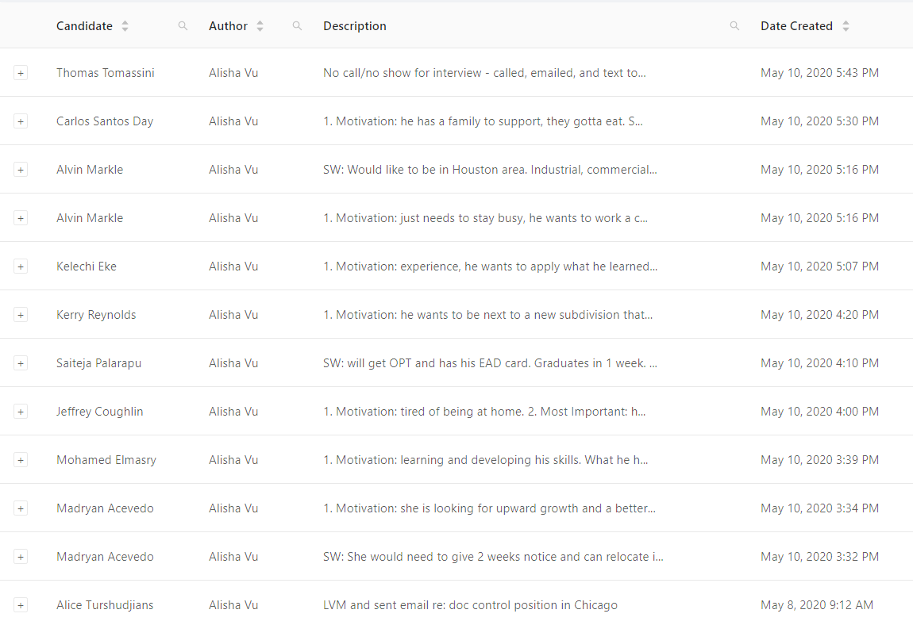

> Detailed information about notes can be found in the [Notes](admin-guide.md#notes_2) section.

---

#### Interviews

> The `Interviews` tab is divided into two sections:

- `Requested`: List of all interviews requested by the client

> 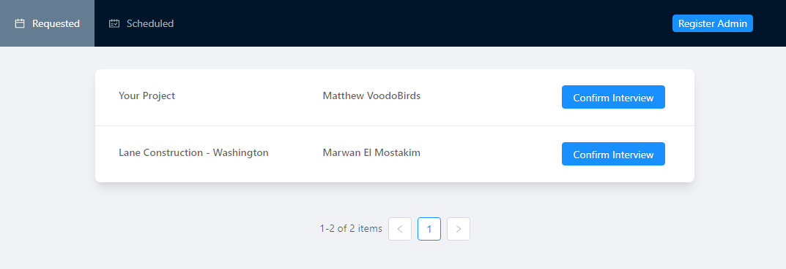

> You can click the "Confirm Interview" button to select the interview time and confirm the interview for both the candidate and the client.

> 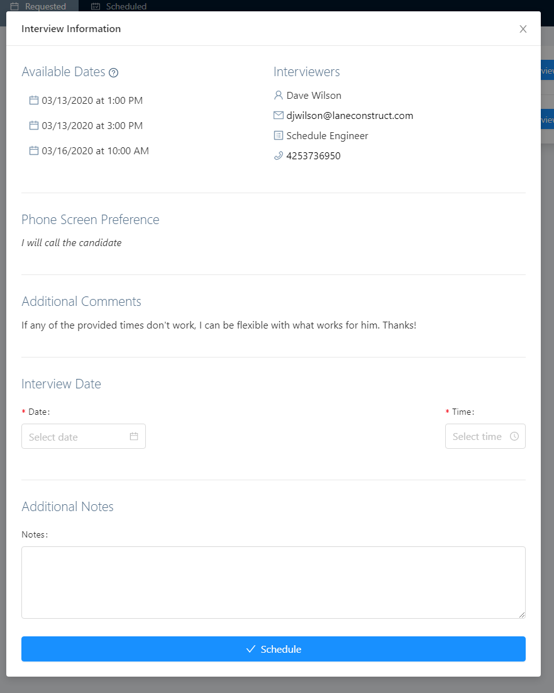

- `Scheduled`: List of all interviews shceduled and confirmed

> 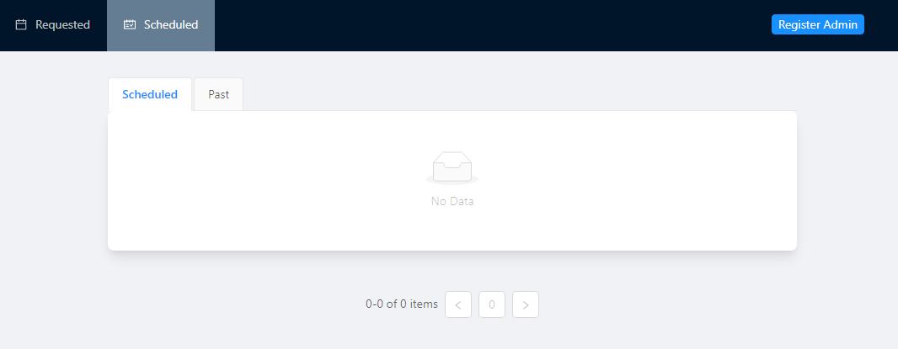

> You can also select the `Past` tab to see the previously scheduled interviews.

> 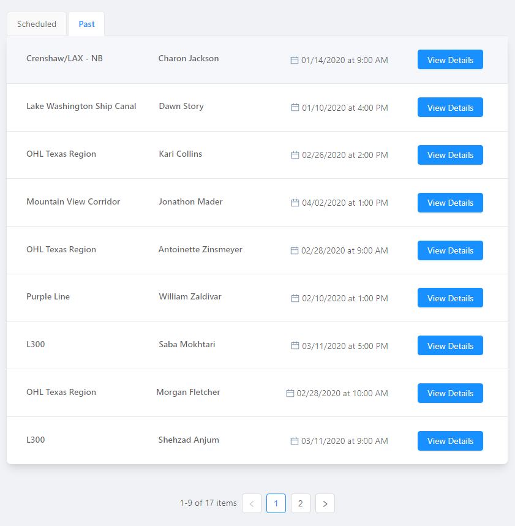

---

#### Hires

> The `Hire` tab contains a table that displays all hired candidates.

> 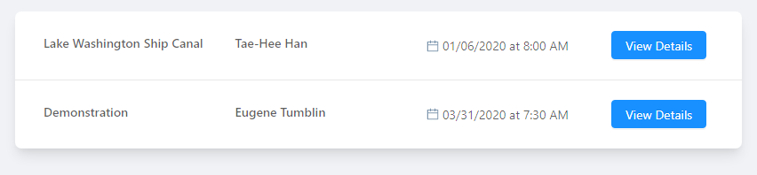

> You can click the `View Details` button to see additional information about the hire:

> 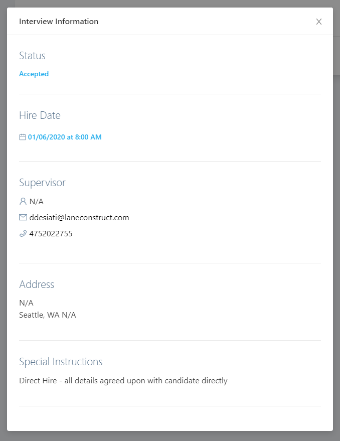

---

#### Log Out

> The `Log Out` tab exits your current session:

> 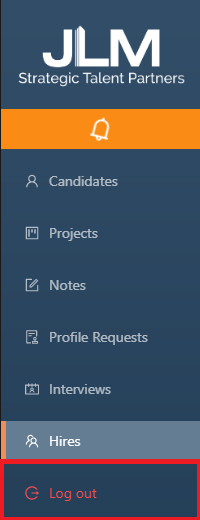

---

<!-- Candidates Section -->

## Candidates

> Candidates are one of the quinessential entities within the application. This section will break down all possible interactions with candidates.

### Creation

> Candidates are created in two different ways:

> - Candidate-side application
> - Admin-side creation

> <strong>Candidate-side</strong> application is when the candidates themselves provide the information necessary to create their own candidate object within TeamBldr. The URL for this type of creation can be found <a href="https://www.profiles.jlmstrategic.com/partial">here</a>.

> As of the current version of this documentation, candidates are directed to the creation page automatically when the Business Analysts qualify the candidates on Workable.

> <strong>Admin-side</strong> creation is when an administrator within the application clicks the `New Profile` button at the bottom left of the candidate dashboard. Doing so will prompt the admin to fill out a few fields:

> 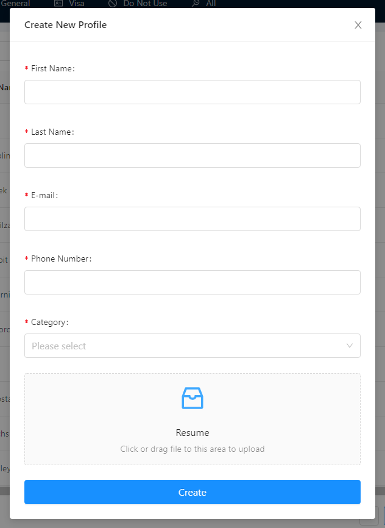

> The completion of either applications will register that candidate to be used throughout the website.

---

### Edit Page

> In the [Candidates](admin-guide.md#candidates) section of the sidebar, you can view individual rows of candidates, each also accompanied by the `Edit` button to the right of the table:

> 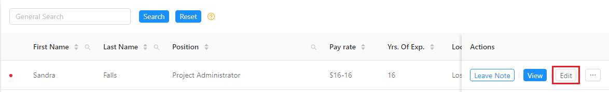

> Clicking the button will navigate you to the candidate's edit page:

> 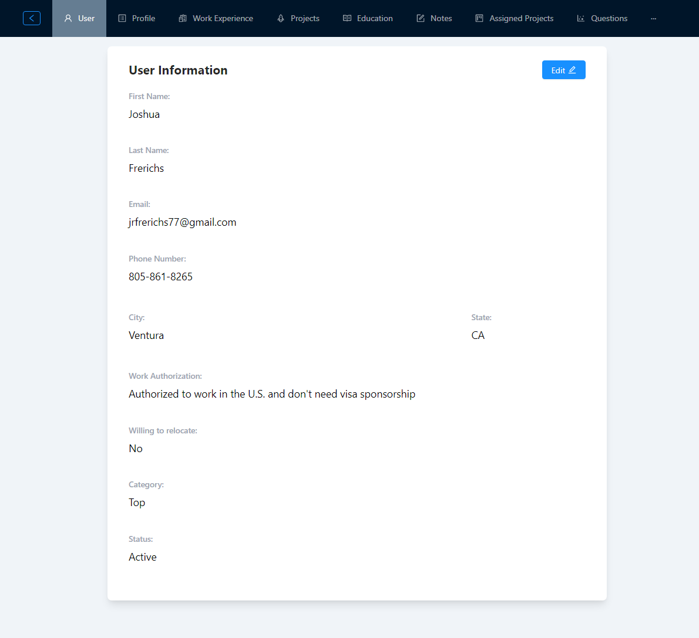

---

#### User Information

> The above image is the `User Information` section. This page holds several fields that are specific to the candidate:

> |        Field        | Description                                          |
> | :-----------------: | :--------------------------------------------------- |
> |     First Name      | First name of the candidate                          |
> |      Last Name      | Last name of the candidate                           |
> |        Email        | Email of the candidate                               |
> |    Phone Number     | Phone number of the candidate                        |
> |     City/State      | The "current" city and state candidate is located in |
> | Work Authorization  | Candidate's work authorization status                |
> | Willing to Relocate | Candidate's willingness to relocate                  |
> |      Category       | Candidate's [Category](admin-guide.md#candidates)    |
> |       Status        | Candidate's status, whether they're active or not    |

> All of these fields become editable once you click the `Edit` button at the top right.

---

#### Profile Information

> The next tab over, you have the `Profile` edit page:

> 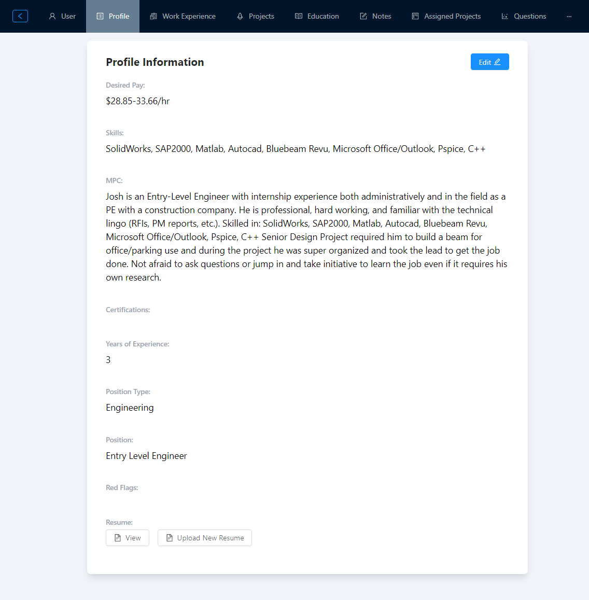

> |        Field        | Description                                                             |
> | :-----------------: | :---------------------------------------------------------------------- |
> |     Desired Pay     | Pay rate of the candidate, set as a range                               |
> |      Skills\*       | List of candidate's skills                                              |
> |         MPC         | The summary of the candidate's skills/experiences                       |
> |  Certifications\*   | List of candidate's certifications                                      |
> | Years of Experience | Candidate's numerical years of experience                               |
> |    Position Type    | Candidate's type of position                                            |
> |      Position       | Candidate's title                                                       |
> |      Red Flags      | Candidate's red flags indicating one's potential inability to be placed |
> |     Resume\*\*      | Candidate's attached resume                                             |

> \*Skills and certifications can be filled out as a comma-separated list (e.g skill1,skill2).

> \*\*Uploading a new resume for the candidate will <strong>replace</strong> the candidate's current resume.

---

#### Work Experience

> The `Work Experience` tab contains the list of candidate's work experiences:

> 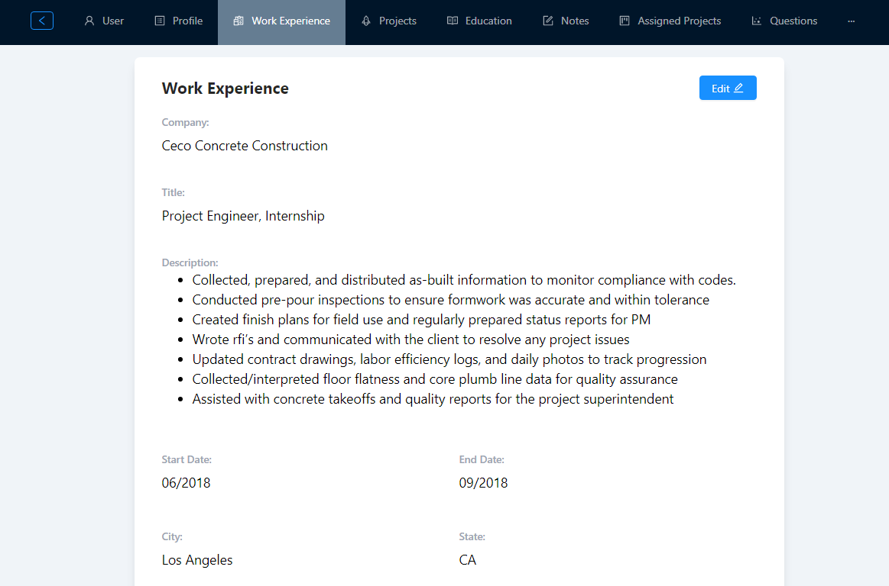

> For each listed experience, you will find:

> |        Field        | Description                                     |
> | :-----------------: | :---------------------------------------------- |
> |       Company       | Name of the company                             |
> |        Title        | Candidate's title at the company                |
> |     Description     | Candidate's list of work experience description |
> | Start Date/End Date | Start and end date at the company               |
> |     City/State      | City and state of the company                   |
>
>  
> Upon clicking the `Edit` button, you will see the option to:

> 1. Remove any work experience

> 2. Add additional work experiences

> 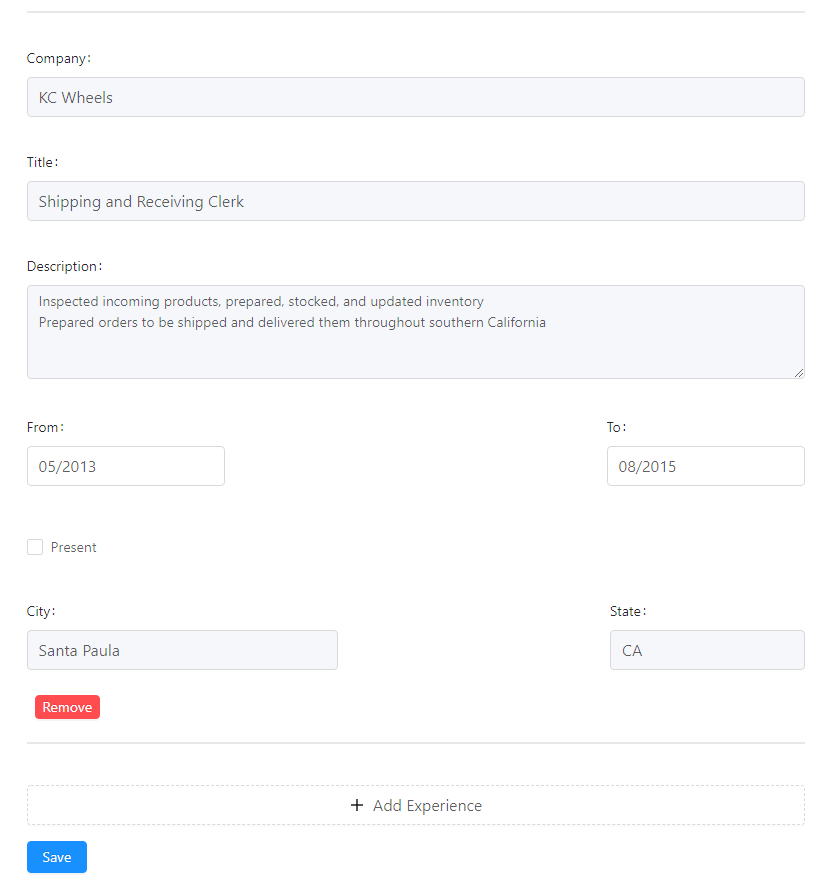

---

#### Candidate-Projects

> Similar to the Work Experience, project tab contains any projects the candidate might have done or contributed to:

> 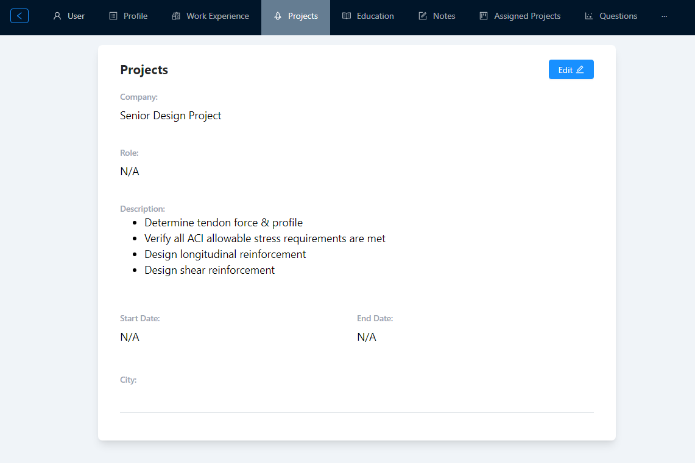

> The fields are very similar to a work experience:

> |        Field        | Description                              |
> | :-----------------: | :--------------------------------------- |
> |       Company       | Name of the company (if any)             |
> |        Role         | Candidate's role for the project         |
> |     Description     | Candidate's list of project descriptions |
> | Start Date/End Date | Start and end date of the project        |
> |        City         | City in which the project took place     |

---

#### Education

> The education tab contains any and all education for the candidate:

> 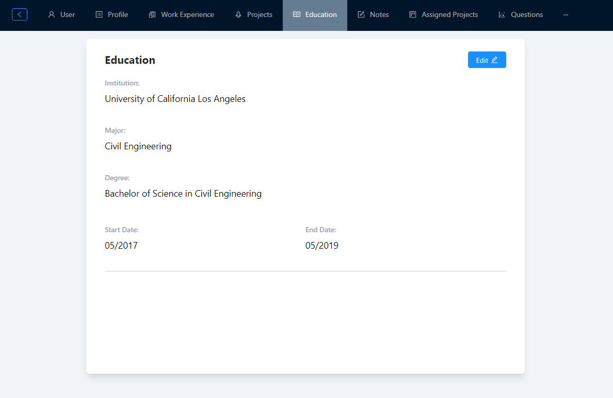

> The fields are as follows:

> |        Field        | Description                                       |
> | :-----------------: | :------------------------------------------------ |
> |     Institution     | Name of the institution                           |
> |        Major        | Candidate's major at the institution              |
> |       Degree        | Degree attained at the institution                |
> | Start Date/End Date | Candidate's start and end date at the institution |

 
> Similar to the work experience and the projects, pressing the `Edit` button allows the admin to `add` additional education fields or `remove` them.
---
#### Notes

> The notes tab contains all the notes left about the selected candidate:

> 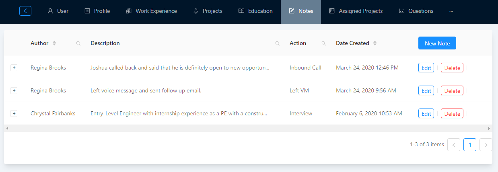

> The display table has the following fields:

> |    Field     | Description                                       |
> | :----------: | :------------------------------------------------ |
> |    Author    | Author of the note (admin)                        |
> | Description  | Candidate's major at the institution              |
> |    Action    | Degree attained at the institution                |
> | Date Created | Candidate's start and end date at the institution |

 

> Clicking the `Edit` button for a note will prompt the following pop-up:

> 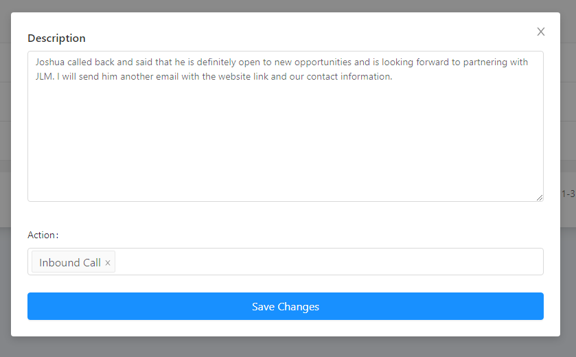

> In this modal, you can edit the description and the action of the note. Note that the `Action` section is a mini-picker, meaning multiple actions can be chosen for one note.

> There are following options available for the Actions:

> |     Field     | Description                                        |
> | :-----------: | :------------------------------------------------- |
> | Inbound Call  | Call that came <strong>from</strong> the candidate |
> | Outbound Call | Call being made <strong>to</strong> the candidate  |
> |    Left VM    | Leaving voice mail for candidate                   |
> | Phone Screen  | Action noted after a phone screen                  |
> | Text Message  | Text message sent to the candidate                 |
> |      MPC      | Action of presenting the candidate to a client     |
> |   Interview   | Noting the occurrence of an interview              |
> |     Email     | Email sent to the candidate                        |

 

> In addition, clicking the `New Note` button will open a slider with the same fields in order to create a new note for the selected candidate:

> 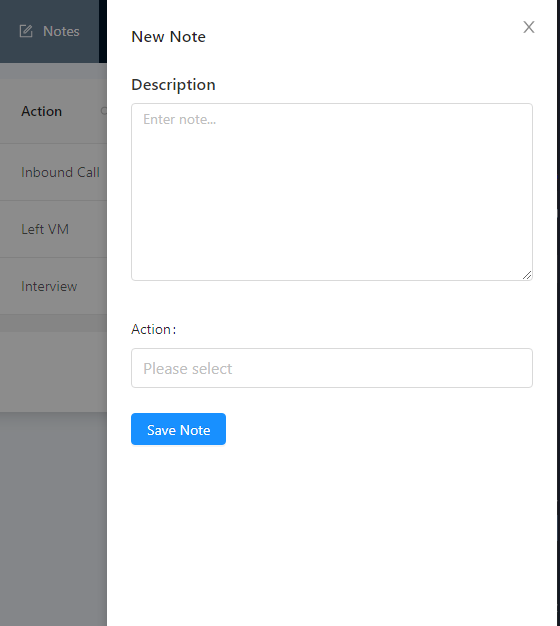

---

#### Assigned Projects

> The `Assigned Projects` tab contains all the projects that the candidate is assigned to:

> 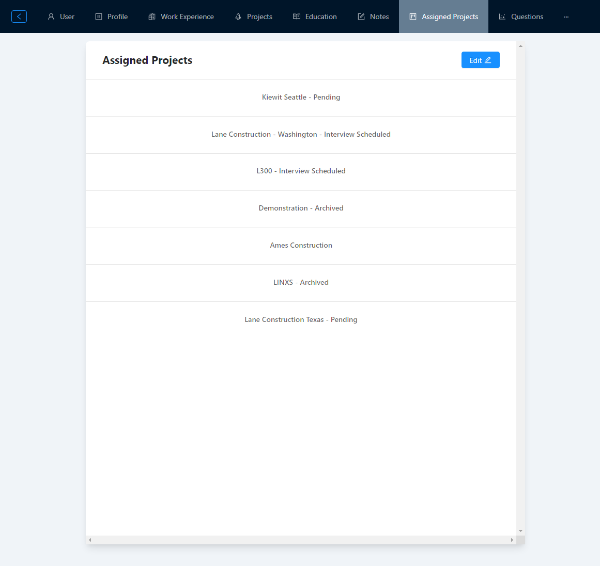

> Notice the format: `Project` - `Stage`.

> Upon clicking the `Edit` button, you will be able to view the following display:

> 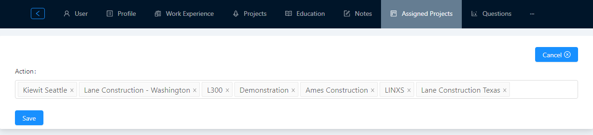

> Notice that this is a mini-picker field, meaning all the projects within the application can be assigned to the candidate.

---

#### Questions

> The questions section contains various questions relevant to the candidate's prior experience, availability, and more:

> 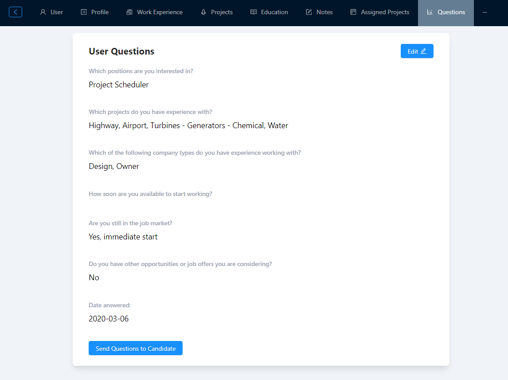

> The fields are as follows:

<ul>
<li>What position are you interested in?</li>
<li>Which projects do you have experience with?</li>
<li>Which of the following company types do you have experience working with?</li>
<li>How soon are you available to start working?</li>
<li>Are you still in the job market?</li>
<li>Do you have other opportunities or job offers you are considering?</li>
<li>Date answered</li>
</ul>

> Pressing the `Send Questions to Candidate` sends an email to the candidate in the following template:
> 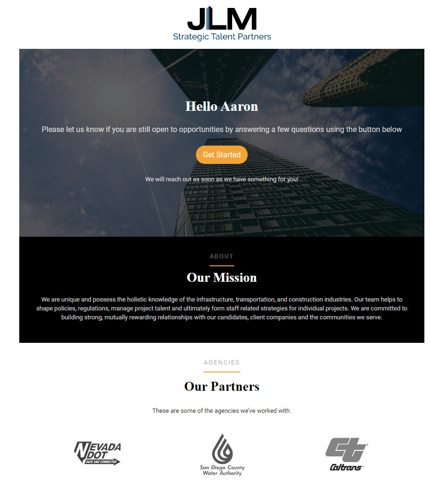

 

> The candidate will view the following page once he/she clicks `Get Started`:

> 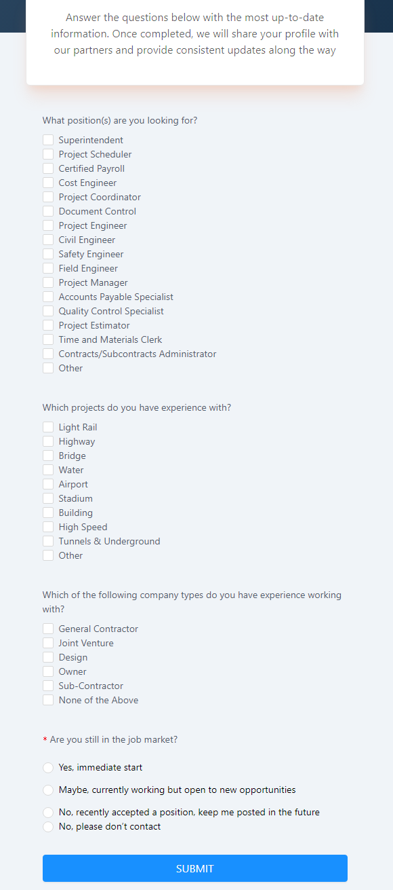

---

#### Logs

> The logs section lists all the activities involving the candidate:

> 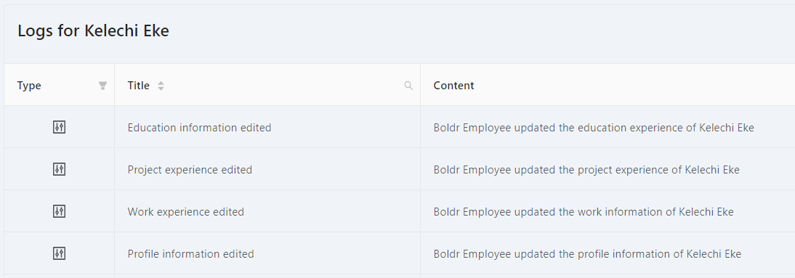

> The columns are as follows:

> |    Field    | Description                                                                |
> | :---------: | :------------------------------------------------------------------------- |
> |    Title    | Action type of the log                                                     |
> |   Content   | Description of the log, stating the author of the action and the recipient |
> | Time & Date | Timestamp of when the event was logged                                     |

---

#### Profile

> The last tab in the candidate edit page renders the candidate's profile formatted by TeamBldr:

> 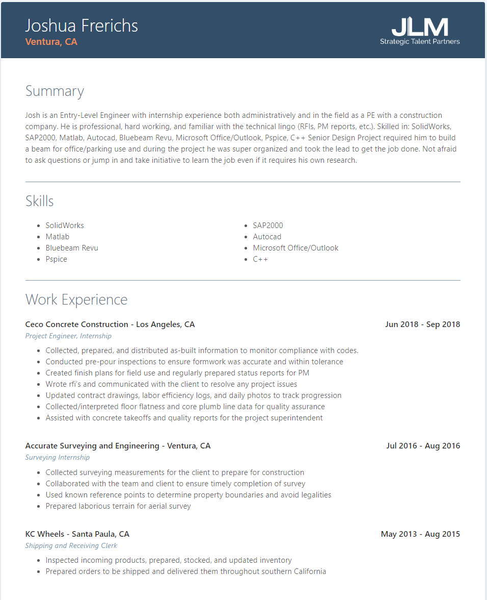

> This profile has information that accumulates all of the candidate's information into a single page.

---

<!-- Projects Section -->

## Projects

> Project is the other main entity within the application. It is a client-side entity that candidates can be associated with.

> From the [`Projects`](admin-guide.md#projects) section in the sidebar, pressing `Dashboard` will take you to the client's view of the application. Please see the [Client-side Guide](client-guide) for more information about the client-side view.

> Clicking the `Edit` will take your to the project edit page:

> 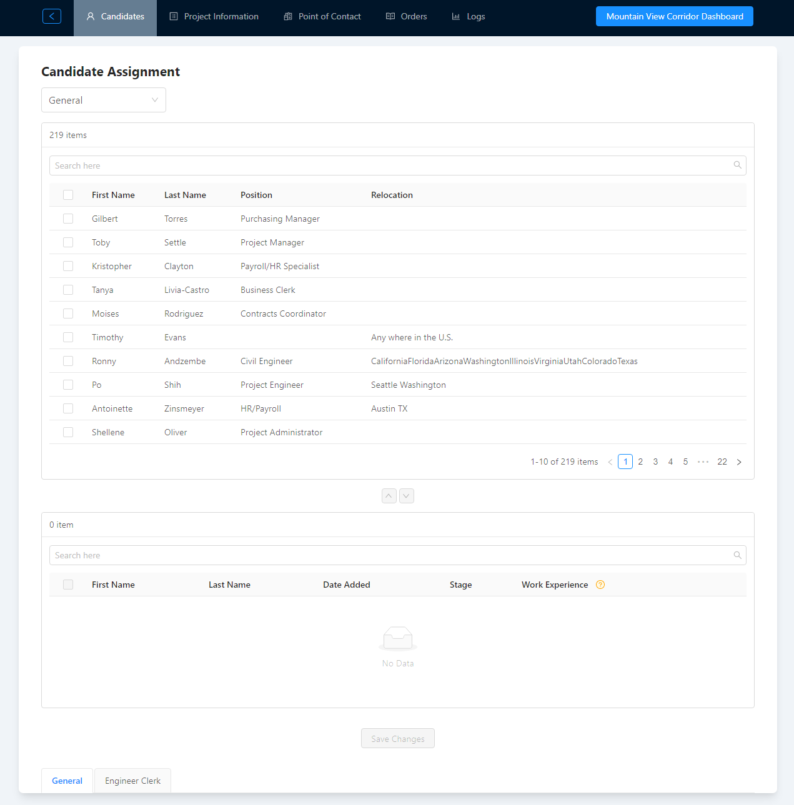

---

### Candidates

> The default tab will be the `Candidates` tab, which handles the candidate-project `Association` within the application. Because this is a very detailed component within the project edit, there will be a separate section dedicated to [Association](admin-guide.md#association).

---

### Project Information

> The `Project Information` tab will display the basic information about the project:

> 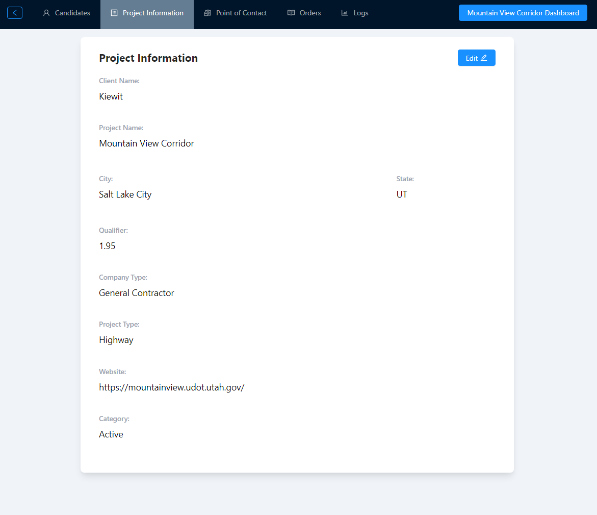

> The available fields for a project consist of:

> |    Field     | Description                          |
> | :----------: | :----------------------------------- |
> | Client Name  | Name of the client                   |
> | Project Name | Name of the project under the client |
> |     City     | City where the project takes place   |
> |    State     | State where the project takes place  |
> |  Qualifier   | Qualifier for the project            |
> | Company Type | Type of company                      |
> | Project Type | Type of project                      |
> |   Website    | Website of the project               |
> |   Category   | Category of the project              |

 

> There are different values for the `Company Type`, `Project Type`, and `Category`:

`Company Types`:

<ul>
<li>General Contractor</li>
<li>Joint Venture</li>
<li>Design</li>
<li>Owner</li>
<li>Sub-Contractor</li>
</ul>

`Project Types`:

<ul>
<li>Light Rail</li>
<li>HighWay</li>
<li>Bridge</li>
<li>Water</li>
<li>Airport</li>
<li>Stadium</li>
<li>Building</li>
<li>High Speed</li>
<li>Tunnels & Underground</li>
<li>Other</li>
</ul>

> <i>Selecting `Other` will prompt a text field to input the project type value.</i>

`Category`:

> The categories are as defined in the [Project Sidebar](admin-guide.md#projects) section.

---

### Point of Contact

> This sections contains the basic information about the main point of contact designated for this project:

> 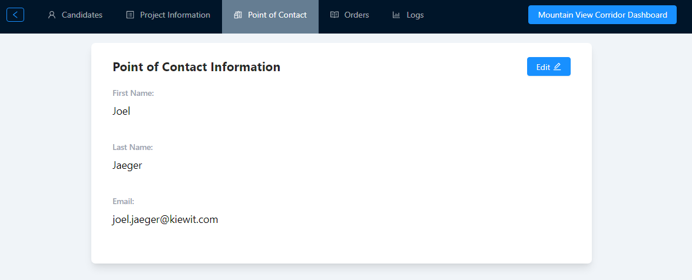

The fields are:

<ul>
<li>First Name</li>
<li>Last Name</li>
<li>Email</li>
</ul>

---

### Orders

> This section includes any orders created under the project:

> 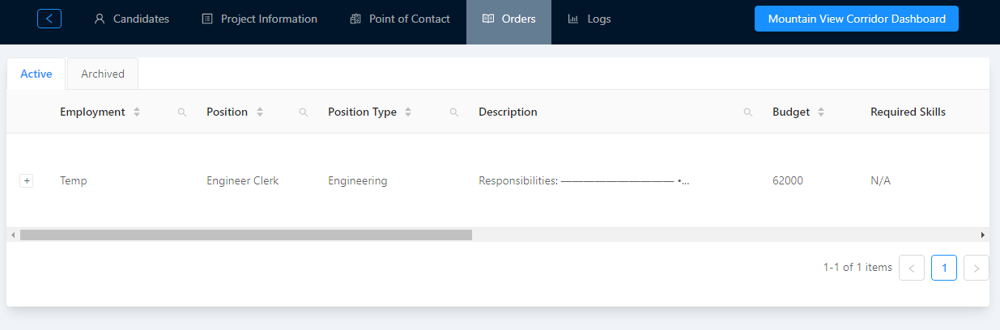

> At the right-side of the table, there is an `Edit` button to edit details about that order:

> 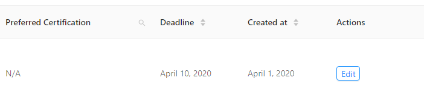

> Clicking the edit will allow the admin to edit details about the order:

> 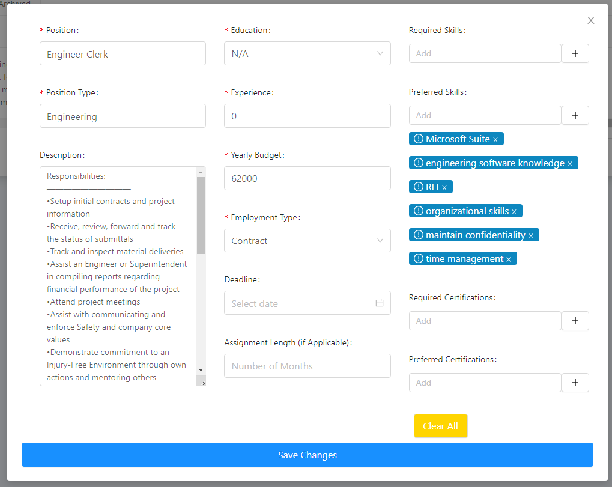

> Details about the orders can be found in the [Client-side Orders](client-guide.md#orders) section

---

### Logs

> Similar to the [Candidate Logs](admin-guide.md#logs), the project logs section has all the activities related to the project:

> 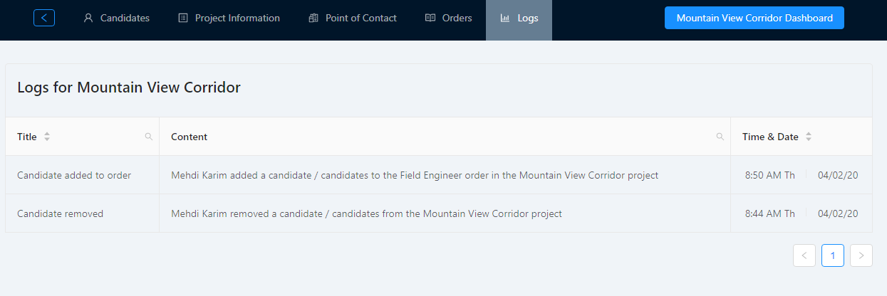

---

### Project Dashboard

> The blue `Project Name Dashboard` button leads to the client-side of the application. Details about this portion of the application can be found in the [Client-side Section](client-guide.md).

---

<!-- Assoication Section> -->

## Association

> This section covers the candidate-project association as mentioned by the initial [Projects Section](admin-guide.md#candidates_2). This is where candidates can be added to a specific project or order, for the clients to be able to see whose candidates have been associated. Here is the page again as a refresher:

> 

> The top table represents the list of candidates, grouped by the candidate's categories. The categories are the criteria defined in the [Candidates](admin-guide.md#candidates) section.

> 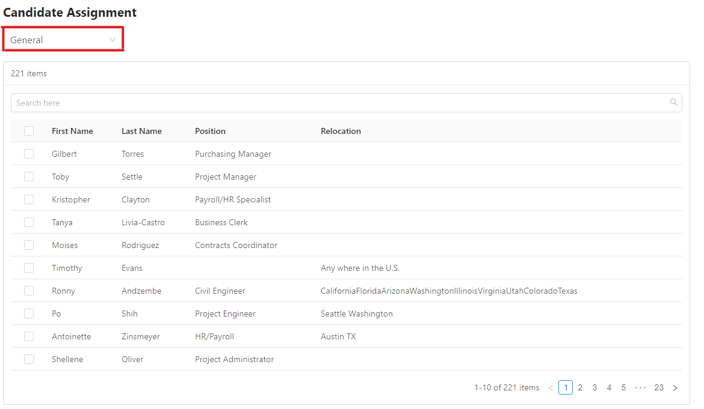

> The fields displayed for each candidates are:

> |   Field    | Description                                      |
> | :--------: | :----------------------------------------------- |
> | First Name | First name of the candidate                      |
> | Last Name  | Last name of the candidate                       |
> |  Position  | Position of the candidate                        |
> | Relocation | Areas where the candidate is willing to relocate |

 

> General is the default candidate category that loads upon navigating to this page.

> Notice the open checkbox for each of the candidates. Upon clicking the checkbox, the down `v` arrow becomes enabled:

> 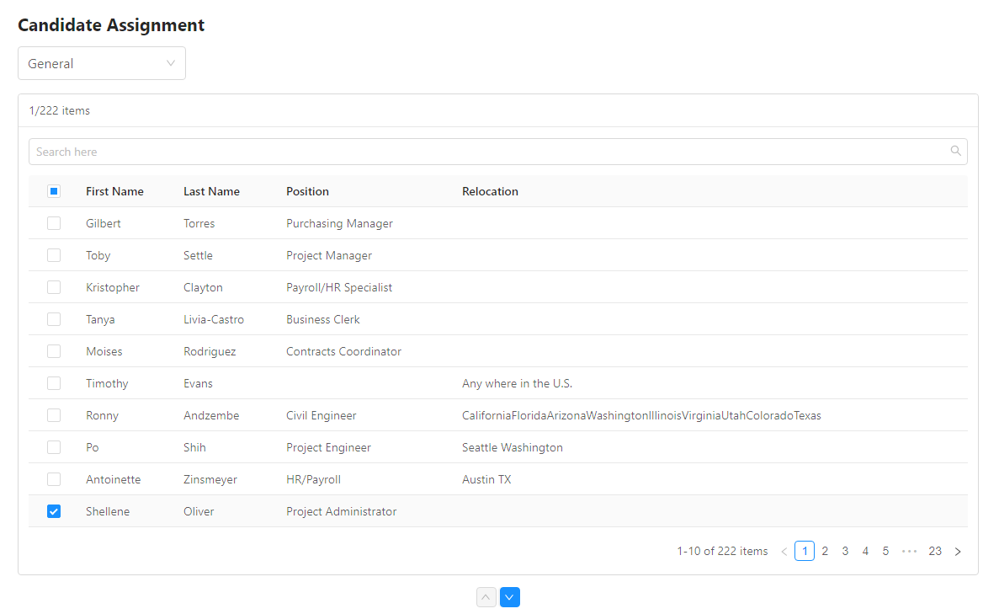

> This indicates that the selected candidates can be added to the current project.

> Upon clicking the `v` button, the candidates will be moved to the bottom table, and the `Save Changes` button becomes available.

> 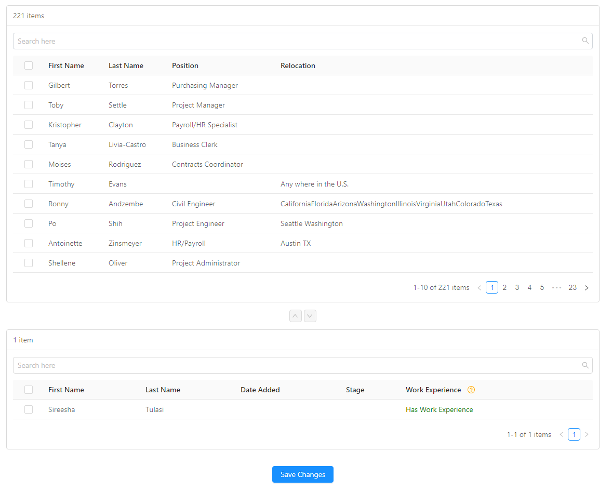

> Once you click the button, the candidates will be associated and will stay in the bottom table. This indicates that the candidates have been successfully associated to the project:

> 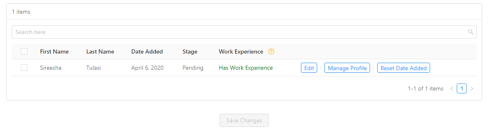

> You'll notice from the above image that after a successful association, several buttons and fields are generated per candidate row. The new fields are:

> |      Field      | Description                                                                                                         |
> | :-------------: | :------------------------------------------------------------------------------------------------------------------ |
> |   Date Added    | Date in which the candidate was associated to the project                                                           |
> |      Stage      | The current stage in which the candidate is in within the interview pipeline. Set to "Pending" by default           |
> | Work Experience | Displays candidate's work experience status, to indicate whether or not their profiles will seem complete or sparse |

> Note the `?` Tooltip available next to the `Work Experience` column. Feel free to hover over the tooltip to view more detailed information about the purpose of the field.

> For each candidate associated, 3 action button will also be generated:

> |      Field       | Description                                                                      |
> | :--------------: | :------------------------------------------------------------------------------- |
> |       Edit       | Displays a pop-up that allows the admin to set candidate's position and pay rate |
> |  Manage Profile  | Allows the admin to unlock the candidate's profile in advance                    |
> | Reset Date Added | Restarts the 48-hour rule for the candidate                                      |

 
For more information about some of these fields and the next steps in the association process, please check out the [client-side](client-guide.md) documentation.

Lastly, at the bottom of the page, you might notice the different tabs:

> 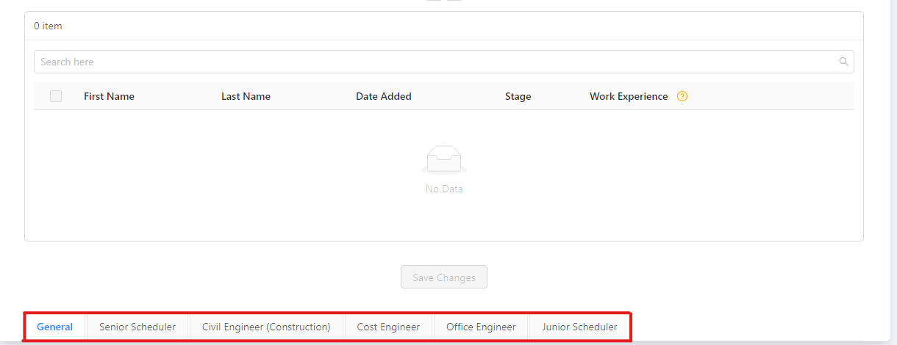

> Each of the tabs (with the exception of `General`) correspond to an order that has been created for the client. Please view the [Orders](client-guide.md#orders) section for more information about the details of what constitues an order.

> When switching to any of the orders tab, one additional category becomes available in the drop down: `Recommended`.

> 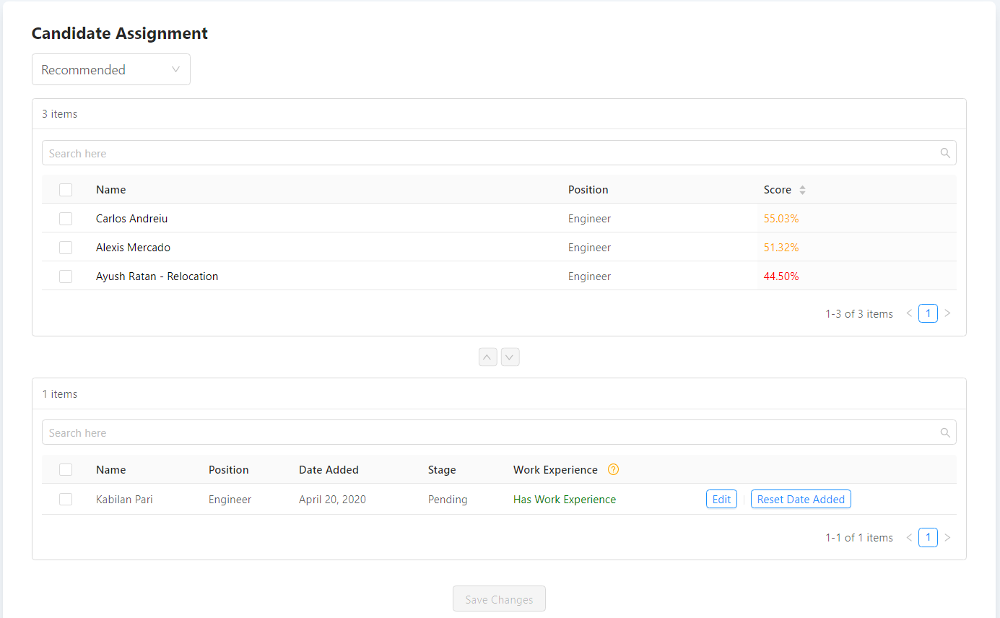

> The `Recommended` category loads candidates whose profile matches the details of the selected order. Notice from the above image that the position matches the order selected and is accompanied by a match score. This is a rough measure of how well the candidate would fit with this order.

> For a detailed explanation of what criteria go into creating this match, please view the [Matching Algorithm](tech.md#matching-algorithm) section.
