# Client-side Guide

> This guide will focus on the client-side of the application.

## Client Dashboard

> All client dashboards follow this layout:

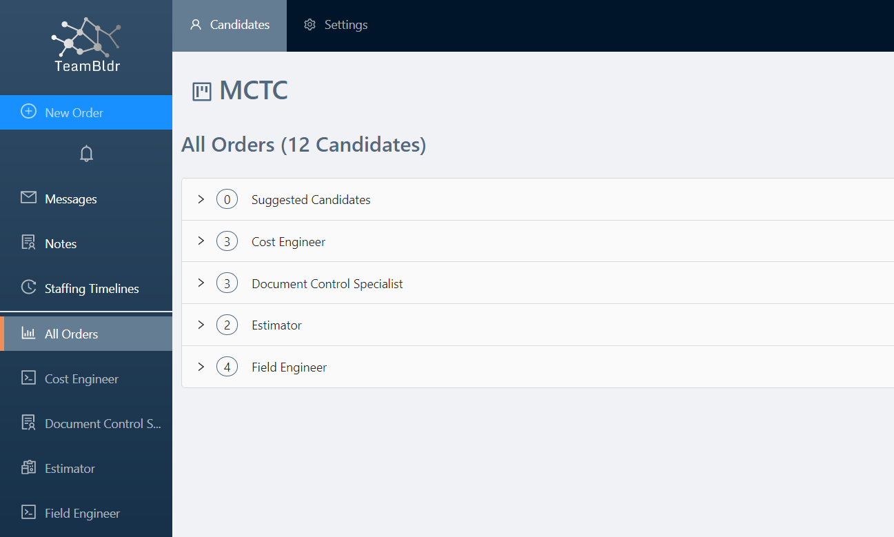

### Sidebar Components

> The sidebar is divided into the following sections:

> |                         Category                         | Description                                               |
> | :------------------------------------------------------: | :-------------------------------------------------------- |
> |           [Messages](client-guide.md#messages)           | Displays relevant messages between candidates and clients |
> | [Staffing Timelines](client-guide.md#staffing-timelines) | Displays time table for which the client wants to hire    |
> |           [All Orders](client-guide.md#orders)           | Displays all candidate catergorization for all orders     |
> |             [Orders](client-guide.md#orders)             | Displays candidate categorization for a specific order    |

#### Messages

> The messaging feature is intended to be a "direct" line of communication between the client and the candidate.
> Clients can ask candidate direct questions by clicking the "Ask" button on an individual candidate row:

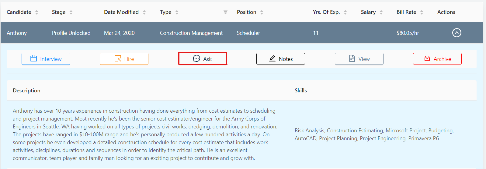

> The button will prompt the following modal:

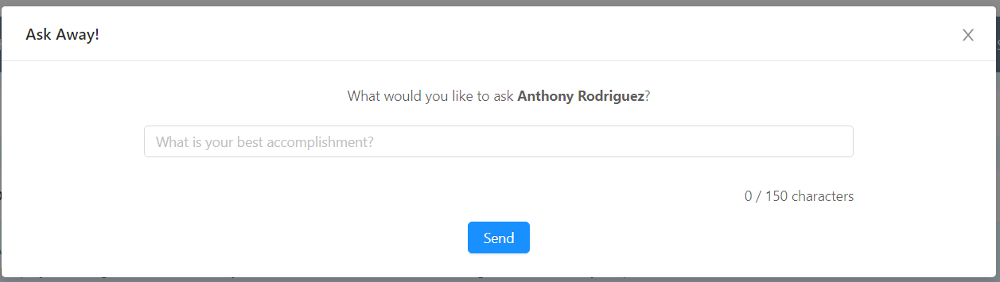

Upon clicking `Send`, the message will be sent to the candidate and the history of questions/responses will be appended to the `Messages` section:

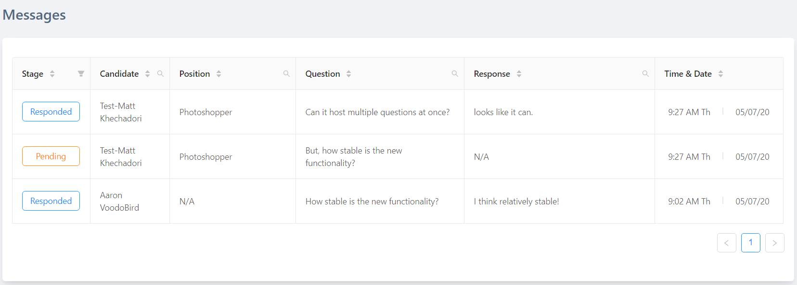

---

#### Notes

> This section lists the history of any notes left by the client on the candidates:

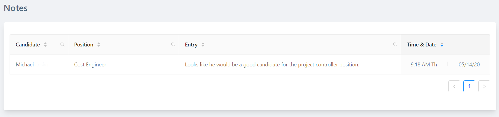

> Please refer to the various actions for the candidate types to read further about the notes.

---

#### Staffing Timeline

> This component is dedicated to creating a timeline for which the client wishes to hire.
> When entering the page for the first time, the client will be prompted to fill out his/her first timeline:

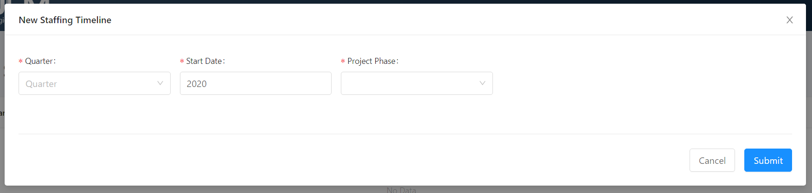

> The required fields for the timeline are as follows:

> |     Field     | Description                                              |
> | :-----------: | :------------------------------------------------------- |
> |    Quarter    | Designated quarter for which the timeline will be set-up |
> |  Start Date   | Date depicting when the hiring will start                |
> | Project Phase | The phase of the project for the hiring timeline         |

 
> Upon pressing `Submit`, the new timeline will be rendered on a table:

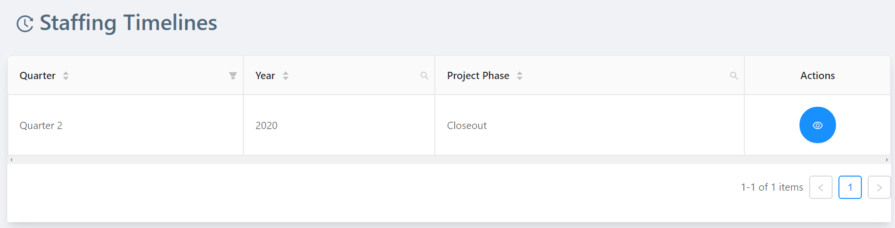

> Clicking the Eye-icon will open a detailed modal for all the timelines created by the client:

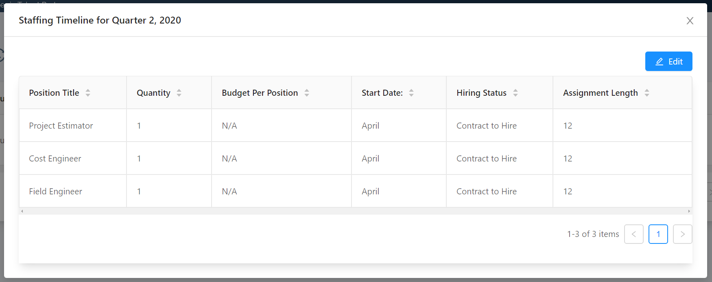

> Clicking `Edit` will allow the client to edit, add, or remove specific positions:

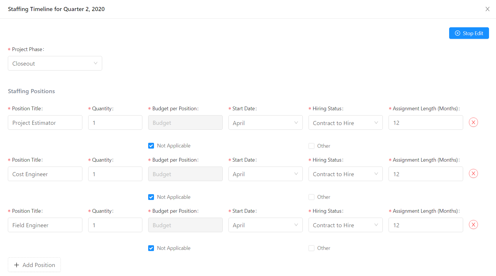

---

#### Orders

The orders display are broken down into two distinct ways of viewing:

<ul>
<li>All Orders</li>
<li>Single Order</li>
</ul>

> <u>All Orders</u> consolidates all of the candidates and categories for each order and sum them up in a single page.
> One main distinction would be that the <u>All Orders</u> page include the `Suggested` candidates section, which are candidates that do not belong to any particular order.

> The cadndiate categorization within each order consists of the following:

> |                     Category                      | Description                                               |
> | :-----------------------------------------------: | :-------------------------------------------------------- |
> |   [Pending](client-guide.md#pending-candidates)   | Candidates that have been associated                      |
> | [Scheduled](client-guide.md#scheduled-interviews) | Candidates whose interviews have been requested/scheduled |
> |     [Hired](client-guide.md#hired-candidates)     | Candidates that have been hired/pending hire              |
> |     [Saved](client-guide.md#saved-candidates)     | Candidates that the client decided to save for later      |
> |  [Archived](client-guide.md#archived-candidates)  | Candidates that the client is not interested in           |
>
>  

> Please refer to the respective sections for each of the categories.

---

### Pending Candidates

> The pending candidates represent the list of candidates that have been associated with the project/order and are pending action from the client:

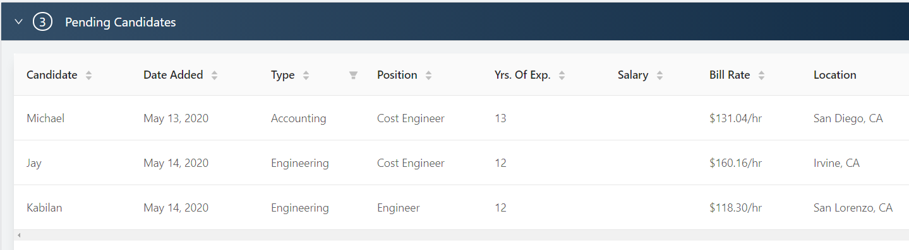

There are list of actions that become visible when any of the candidate rows are clicked:

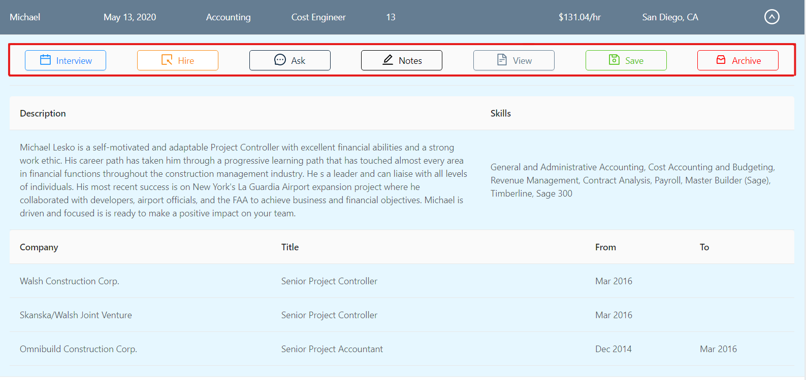

> The possible actions include:

> |  Action   | Description                                                                                                                                                                 |
> | :-------: | :-------------------------------------------------------------------------------------------------------------------------------------------------------------------------- |
> | Interview | Schedules an interview with the candidate and moves them to the [Scheduled Interviews](client-guide.md#scheduled-interviews) section                                        |
> |   Hire    | Hires the candidate and moves them to the [Hired](client-guide.md#hired-candidates) section                                                                                 |
> |    Ask    | Allows client to prompt a question directly to the candidate. The history of candidate-client interaction will be saved in the [Messages](client-guide.md#messages) section |
> |   Notes   | Allows the client to leave notes on the candidate                                                                                                                           |
> |   View    | Loads the candidate's profile                                                                                                                                               |
> |   Save    | Keeps the candidate associated and moves them to the [Saved](client-guide.md#saved-candidates) section                                                                      |
> |  Archive  | Removes the candidate from interactivity and moves them to the [Archived Candidates](client-guide.md#archived-candidates) section                                           |

---

#### <u>Schedule Interview Action</u>

> Pressing the `Interview` button opens the following modal:

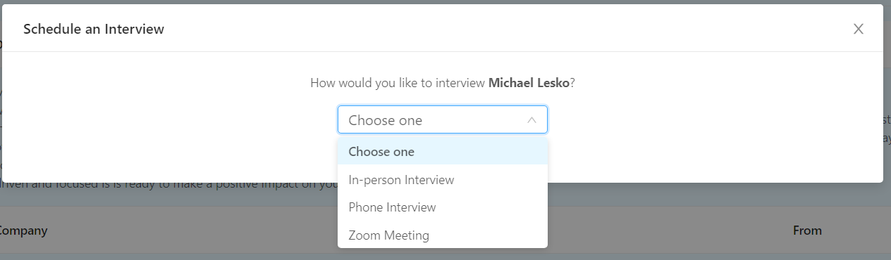

> Selecting one of the interview types will dynamically generate the approrpriate form to accommodate the type of interview.

> Regardless of the option selected, the following part of the form will always render:

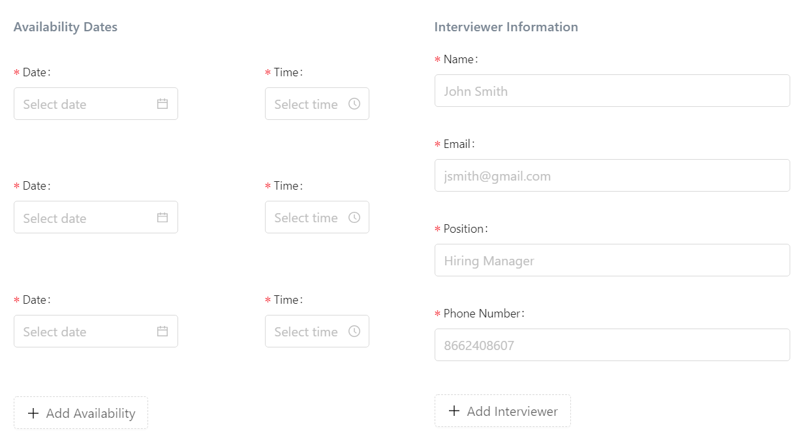

> The main differences between the sections are highlighted as follows:

##### In-Person Interview

> In-Person Interview option will render the location fields:

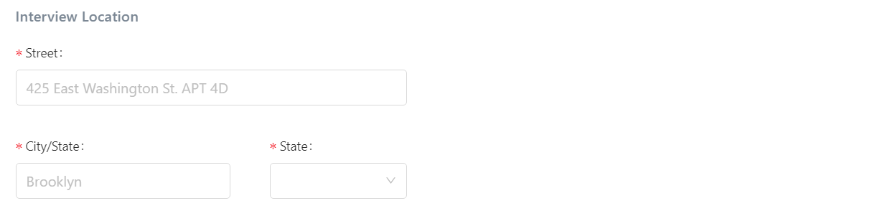

##### Phone Interview

> In-Person Interview option will render the phone screen preference options:

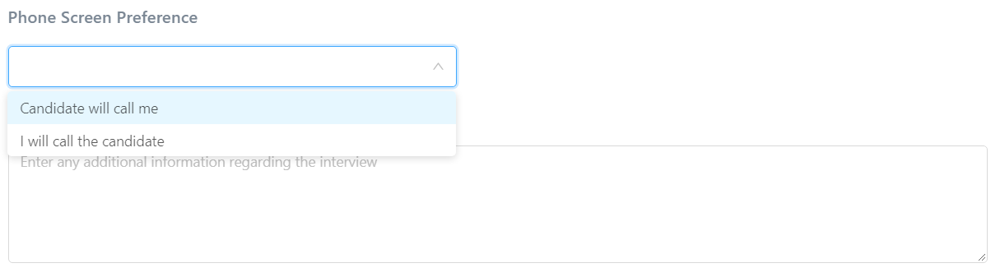

##### Zoom Interview

> Zoom Interview option will only render the general interview form but it will make an API call to schedule a meeting through Zoom directly.

---

> Through any of the above interview options, the candidate will receive the following view in their email:

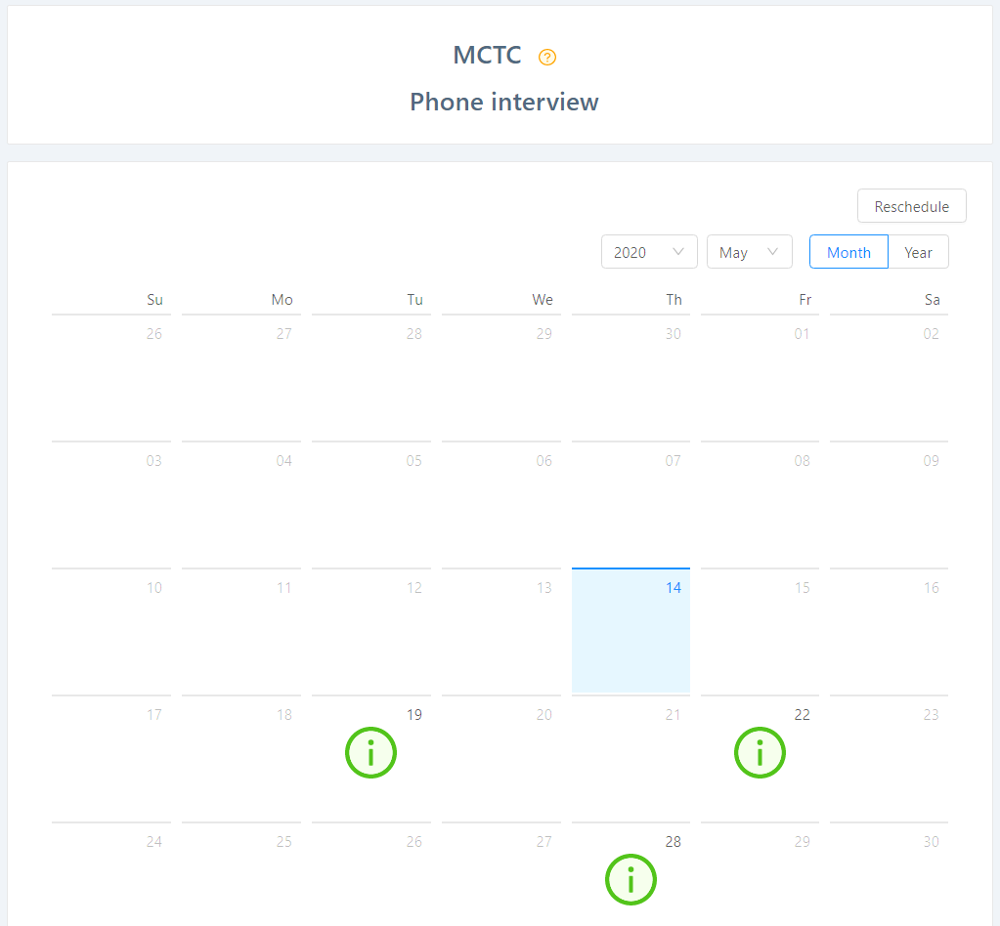

> The (i) Icon indicates the date chosen by the client and the candidate will be prompted to select one of those times.

> As shown in the image, there is a `Reschedule` button which will prompt the client to choose a different time for the interview.

---

#### <u>Hire Action</u>

> Pressing the `Hire` button opens the following modal:

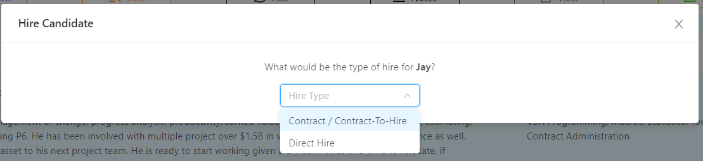

> The fields dynamically render depending on the option chosen.

> <u>Contract / Contract-To-Hire</u>

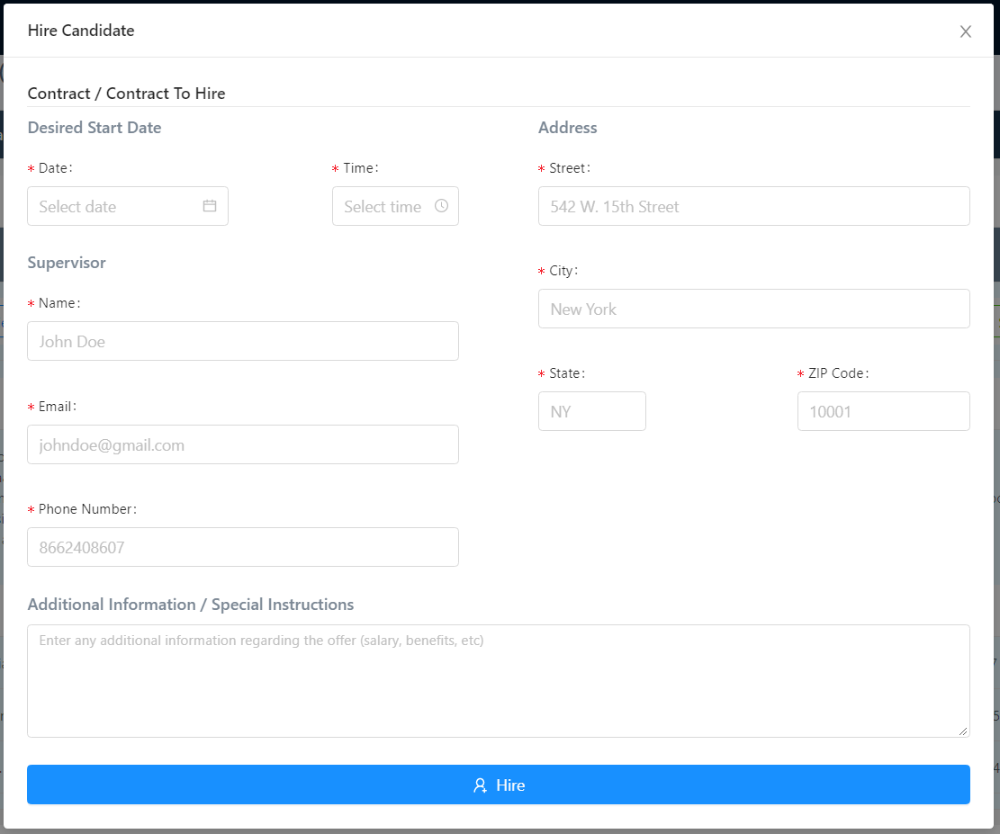

> <u>Direct Hire</u>

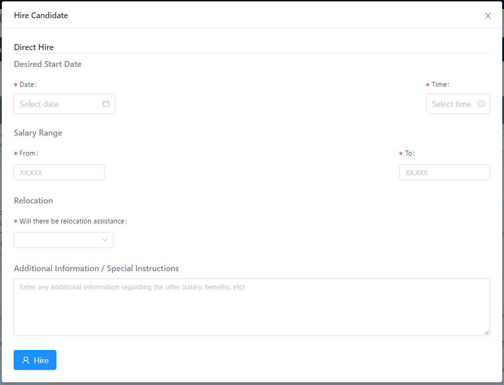

---

#### <u>Ask Action</u>

> The `Ask` button prompts a modal that allows clients to directly ask questions to the selected candidate.

Please see the [Messages](client-guide.md#messages) section for how this action works.

---

#### <u>Notes Action</u>

> The `Notes` buttton prompts a modal that allows clients to leave notes about the selected candidates

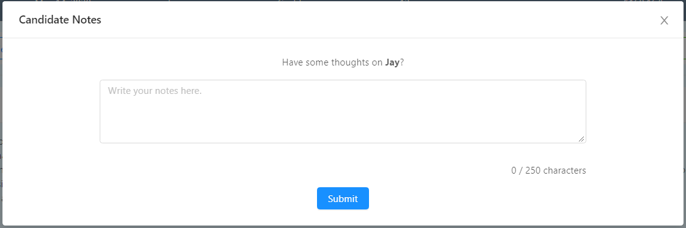

> Upon writing the notes and clicking the `Submit` button, the note will become available as part of the modal:

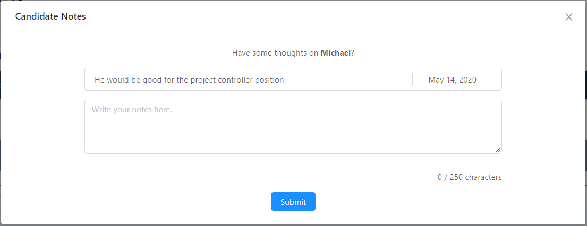

> The note will also become visible in the [Notes](client-guide.md#notes) section.

---

#### <u>View Action</u>

> This action loads the candidate's profile based on the candidate's various information within TeamBldr:

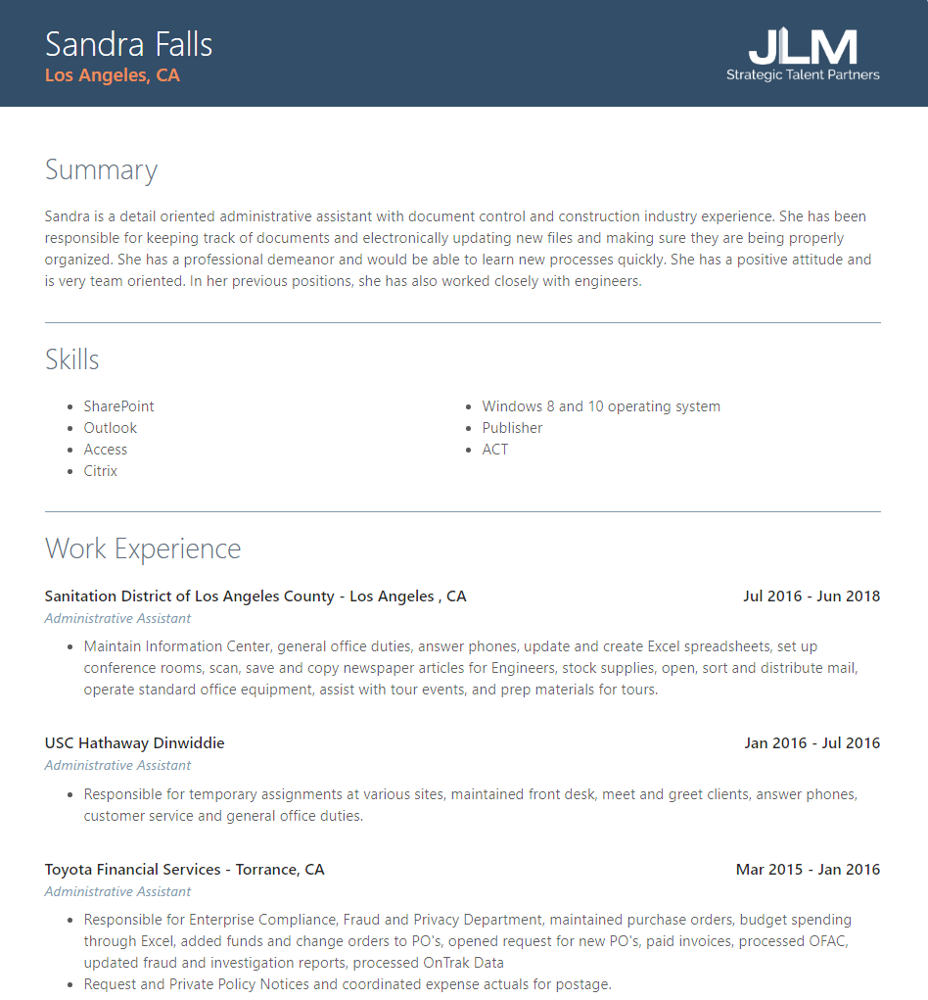

---

#### <u>Save Action</u>

> This action indicates that the client is interested in the candidate, but not at this time. These candidates will be housed in the [Saved Candidates](client-guide.md#saved-candidates) section.

---

#### <u>Archive Action</u>

> This action indicates that the client is not interested in the candidates. The action opens the following modal:

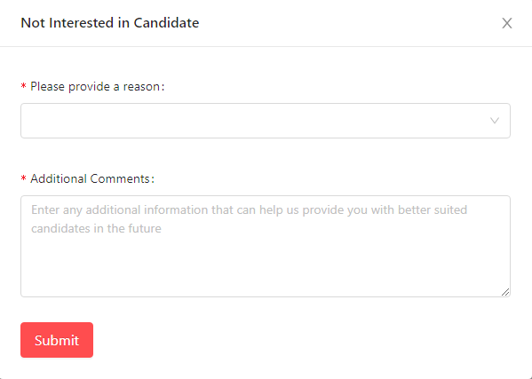

> Initiating this action requires a reason for archiving and also prompts a textbox for additional comments.

> Archive reasons are displayed as follows:

> |             Field              |
> | :----------------------------: |
> | Not enough relevant experience |
> | Not enough years of experience |
> |       Bill rate too high       |
> |     Missing certification      |
> |             Other              |

 

> Upon submitting the form, the candidate is moved to the [Archived Candidates](client-guide.md#archived-candidates) section.

---

### Scheduled Interviews

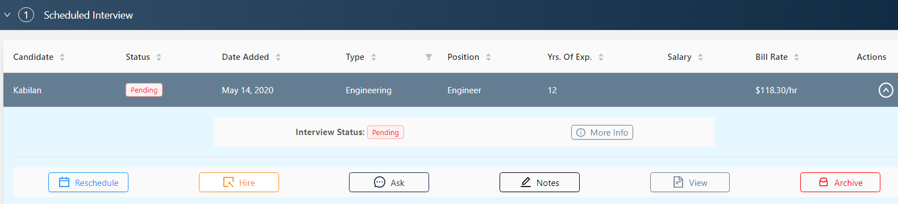

> The candidates in the scheduled interviews mean that their interview have been scheduled or is pending confirmation on the interview.

> The available actions within this section include:

> |   Action   | Description                                                                                                                       |
> | :--------: | :-------------------------------------------------------------------------------------------------------------------------------- |
> | More Info  | Loads additional information regarding the scheduled interview for the selected candidate                                         |
> | Reschedule | Re-prompts the same [Schedule Interview](client-guide.md#schedule-interview-action) action                                        |
> |    Hire    | Hires the candidate and moves them to the [Hired](client-guide.md#hired-candidates) section                                       |
> |    Ask     | Allows the client to ask questions directly to the candidate                                                                      |
> |   Notes    | Allows the client to ask questions directly to the candidate                                                                      |
> |    View    | Loads the candidate's profile                                                                                                     |
> |  Archive   | Removes the candidate from interactivity and moves them to the [Archived Candidates](client-guide.md#archived-candidates) section |

 

> The [`Hire`](client-guide.md#hire-action), [`View`](client-guide.md#view-profile-action), [`Ask`](client-guide.md#messages), [`Notes`](client-guide.md#notes) and [`Archive`](client-guide.md#not-interested-action) actions are identical to the respective actions laid out above.

#### <u>More Info Action</u>

> Clicking the `More Info` action will open a side-tab that displays the following image:

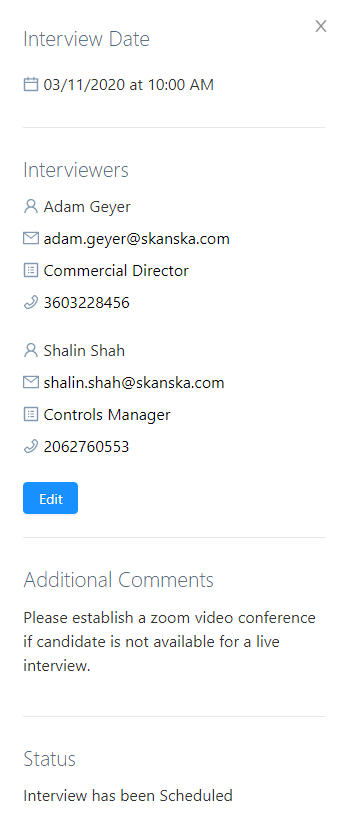

> Note that the interviewers information can be edited, either to correct the information for the inputted interviewers or to add or remove any interviewers.

---

#### <u>Reschedule Action</u>

> The `Reschedule` option will have the same format and layout as the [`Schedule`](client-guide.md#schedule-interview-action) and will simply update the dates and information based on the new inputs.

---

### Hired Candidates

> This tab houses all the candidates that have been hired:

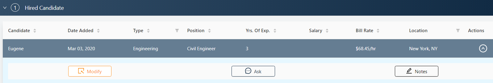

> Clicking the `Modify` button will open the same modal as the [Hire Action](client-guide.md#hire-action) and prompt the client to fill out different information for hiring.

---

### Saved Candidates

> This tab houses all the candidates that have been saved as a result of the [Save For Later](client-guide.md#save-for-later-action) action.

> The actions available are identical to those of the [Pending Candidates](client-guide.md#pending-candidates) section:

> 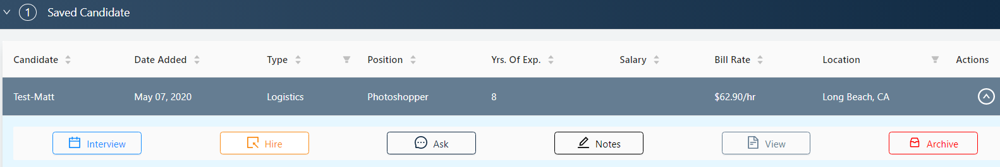

---

### Archived Candidates

> This tab houses all the candidates that have been archived as a result of the [Archive](client-guide.md#not-interested-action) action:

> 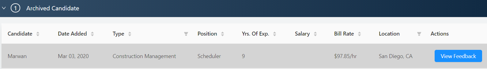

> This tab has an additional field called `View Feedback` which displays the reason and comments related to the candidate's archival:

> 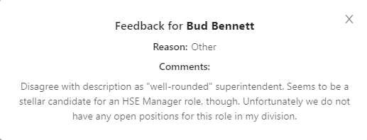

---

## Orders

> `Orders` are specific positions that the clients want filled. They request an "order" from us and we attempt to fill them.

> Orders can be created by pressing the `New Order` button on top of the sidebar:

> 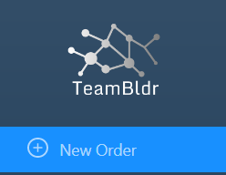

> Clicking the button will take you to the order creation page:

> 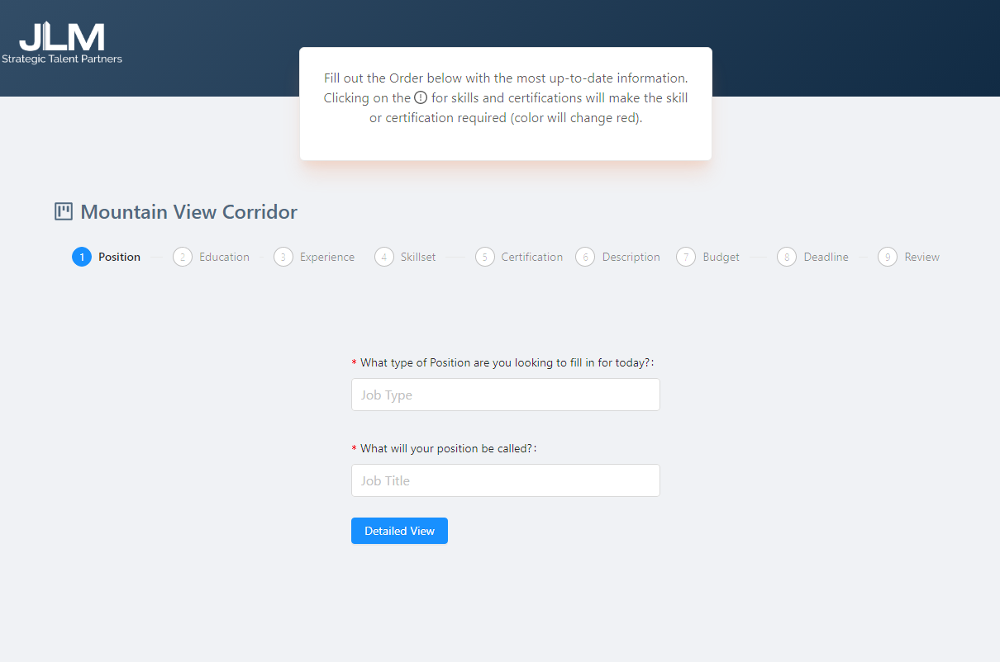

> Although this is the default list-page, we recommend pressing the `Detailed View` button at the bottom of the page. Doing so will navigate to the following page:

> 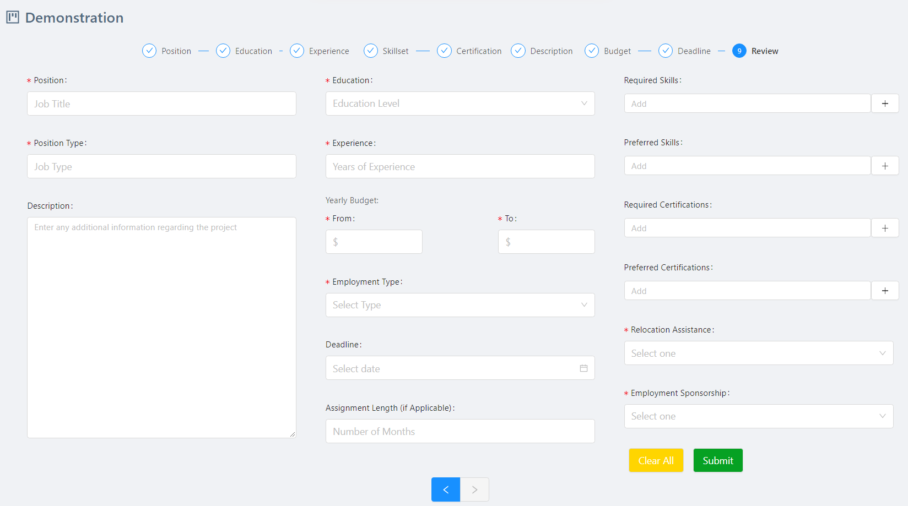

> The available fields for creating an order are as follows:

> |          Field          | Description                                          |
> | :---------------------: | :--------------------------------------------------- |
> |        Position         | Position                                             |
> |      Position Type      | Type of position                                     |
> |       Description       | General responsibilities and requirements            |
> |        Education        | Degree level desired                                 |
> |       Experience        | Years of experience                                  |
> |      Yearly Budget      | Yearly budget required                               |
> |     Employment Type     | Type of project                                      |
> |        Deadline         | Due date for when the order should ideally be filled |
> |    Assignment Length    | Duration of the position                             |
> |     Required Skills     | List of skills required for the position             |
> |    Preferred Skills     | List of skills preferred for the position            |
> | Required Certification  | List of certifications required for the position     |
> | Preferred Certification | List of certifications preferred for the position    |

>  

> Note that filling in the position with one of the drop-down choices will _auto-populate_ majority of the fields.

> Once an order has been created, you can go through the same workflow as the sections highlighted in the general [Client Dashboard](client-guide.md#client-dashboard) section.

---

### Edit

> If you as an administrator or a client want to change the details of an order, going into that order on the client-side bar will now include a new top-option called `Order Details`:

> 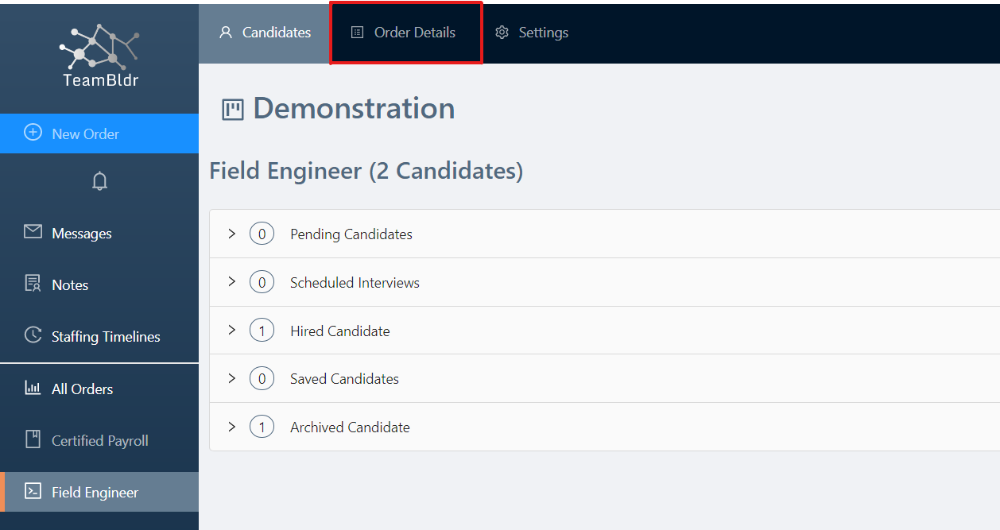

> Clicking the button will navigate you to the following page:

> 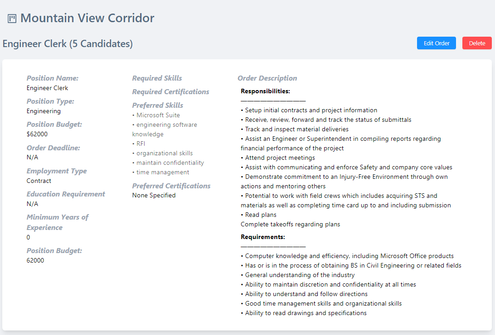

> This is the page in which you can view as well as edit the order by pressing `Edit Order` button.
